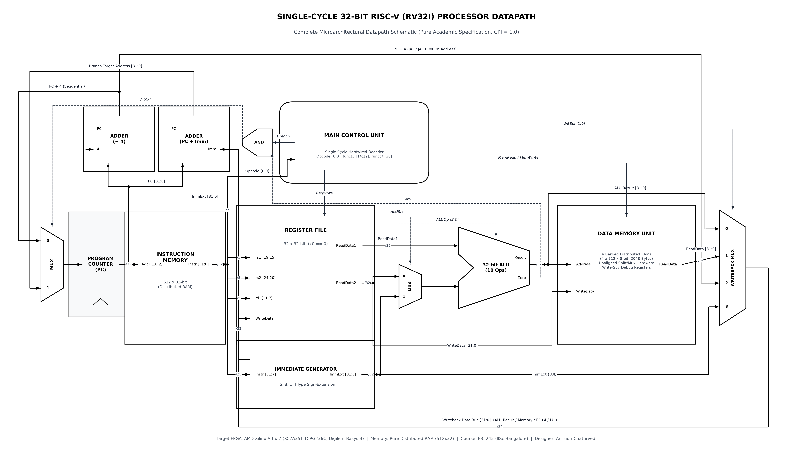

# Single-Cycle 32-bit RISC-V (RV32I) Processor Core with Unaligned Memory Architecture

[-blue.svg)](https://www.xilinx.com)
[](https://digilent.com)
[](https://www.xilinx.com)
[](#)

Synthesizable, from-scratch hardware implementation of a **Single-Cycle 32-bit RISC-V (RV32I) Processor Core** featuring pure Distributed RAM banking, hardware unaligned memory transfers, and physical verification on Digilent Basys 3 FPGA.

## Architectural Datapath Schematic

The microarchitecture is designed strictly to Patterson & Hennessy academic specifications ($CPI = 1.0$), synthesized targeting AMD Xilinx Artix-7 (`XC7A35T-1CPG236C` on Digilent Basys 3) using pure Distributed RAM (LUT RAM) with asynchronous reads:



## Project Structure
```
RV32I_Single_Cycle_Core/
├── docs/
│   ├── RV32I_Single_Cycle_Datapath_Academic.png  <-- Publication-grade monochrome datapath schematic
│   └── rv32i_datapath_academic.tex               <-- TikZ vector source
├── rtl/
│   ├── rv32i_defines.v                           <-- Core ISA constants & ALU opcodes
│   └── alu.v                                     <-- Module 1: 32-bit RV32I ALU (10 Operations)
├── testbench/
│   └── tb_alu.v                                  <-- Self-checking corner-case testbench (10/10 PASS)
├── scripts/
│   └── create_vivado_project.tcl                 <-- Vivado project generation script
├── launch_vivado_gui.bat                         <-- One-click launcher for Vivado 2025.2 GUI
└── README.md
```

## Quick Start (Vivado GUI & Simulation)
1. Double-click `launch_vivado_gui.bat` to launch the project in the AMD Vivado GUI.
2. To run the Module 1 ALU simulation in batch mode with Vivado XSim:
   ```cmd
   xvlog rtl/alu.v testbench/tb_alu.v
   xelab -top tb_alu -snapshot tb_alu_snap
   xsim tb_alu_snap -R
   ```

## Commit Milestone Progression
- `feat(alu)`: 32-bit RV32I ALU, header definitions, and self-checking testbench (10/10 tests passed)
- `docs(schematic)`: Publication-grade academic monochrome datapath schematic
- `chore`: Project hygiene, .gitignore, and Vivado project configuration
